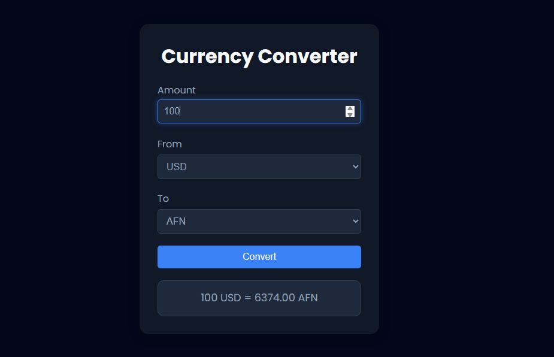

# 💱 Currency Converter App

A modern, responsive Currency Converter Web App built with HTML, CSS, and Vanilla JavaScript.  
It fetches real-time exchange rates using the ExchangeRate API and converts currencies instantly with a clean UI and smooth user experience.

---

## 🚀 Live Demo

👉 https://habibtamkinfx.github.io/currency-converter-app/

---

## 📸 Preview



---

## ✨ Features

- 🌍 Real-time currency exchange rates  
- ⚡ Instant conversion on form submit  
- 🔄 Swap currencies with one click  
- ✅ Input validation (amount & currency check)  
- 🌐 API error handling (network-safe)  
- 🎯 Clean and minimal UI  
- 📱 Fully responsive design  
- 🚀 Fast performance (Vanilla JS)

---

## 🛠️ Tech Stack

- HTML5  
- CSS3 (Modern UI with CSS Variables)  
- JavaScript (ES6+)  
- Fetch API  
- ExchangeRate API  

---

## 📁 Project Structure

```
currency-converter/
│
├── index.html
├── css/
│   └── style.css
├── js/
│   └── script.js
└── assets/
    └── screenshot.png
```

---

## ⚙️ How It Works

- On page load, available currencies are fetched from API  
- Dropdowns are populated dynamically  
- User enters amount and selects currencies  
- On submit:
  - API fetches latest exchange rate  
  - Conversion is calculated  
  - Result is displayed instantly  
- Swap button switches "From" and "To" currencies  

---

## 🔑 Core Functions

- `populateCurrencies()` → Loads currencies from API  
- `fetchExchangeRate()` → Gets real-time rates  
- `validateInputs()` → Validates user input  
- `handleSubmit()` → Handles form submission  
- `calculateConversion()` → Calculates final value  
- `displayResult()` → Shows output  
- `swapCurrencies()` → Switches selected currencies  

---

## ⚠️ Important Notes / Improvements

- Consider adding a loading spinner instead of text "Loading..."  
- Fix small HTML typo:  
  - `from-currnecy` ❌ → `from-currency` ✅  
- You can improve UX by:
  - Auto-conversion on input change  
  - Currency search in dropdown  
  - Saving last selected currencies (localStorage)  

---

## 📈 Future Enhancements

- 🔄 Auto live conversion (no button needed)  
- 🔎 Searchable dropdown for currencies  
- 💾 Save preferences in LocalStorage  
- 🎨 UI animations & transitions  
- 📊 Historical exchange rate chart  

---

## 👨‍💻 Author

Built by: **Habibullah Tamkin**  
💼 Frontend Developer (JavaScript / React Learner)

---

## 📜 License

This project is open-source and free to use for learning purposes.